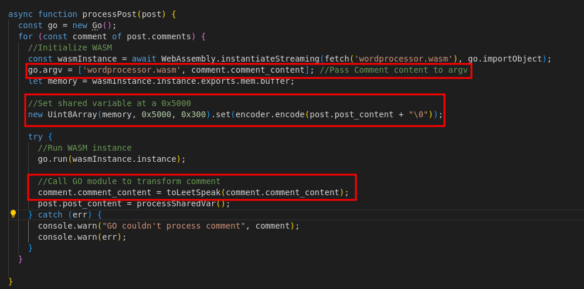
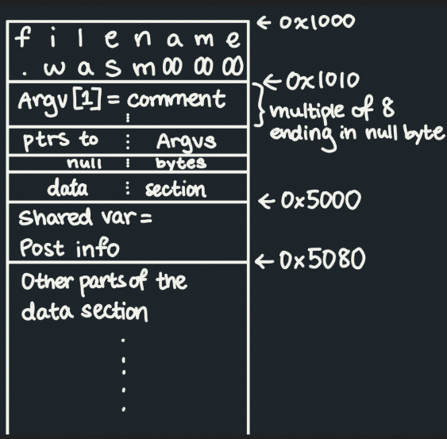
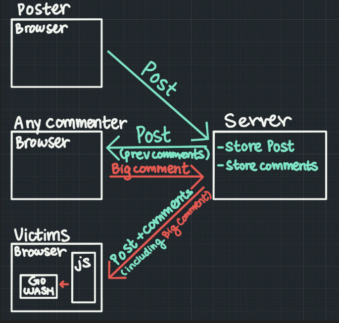
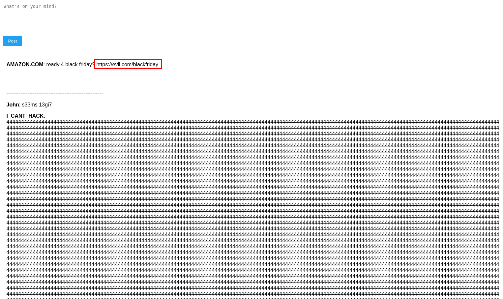

# Exploiting CVE-2021-38297: Vulnerability in GO Wasm Buffer Overflow

## Overview of the Vulnerability
WebAssembly (WASM) serves as a binary instruction format executable in most modern web browsers. It acts as a compilation target for various high-level languages like C, C++, Rust, and GO, allowing code to be written in these languages and compiled into WASM.

CVE-2021-38297 highlights a critical bug within GO's compilation and loading of GO-compiled WASM binaries. The vulnerability resides in the JS wasm loader (`wasm_exec.js`) provided by GO, enabling the loading of WASM binaries with unrestricted data in the `argv` argument. Since `argv` is stored in the linear memory of WASM, malicious actors could exploit this to overwrite the linear memory of the GO-compiled WASM program with an excessively large `argv` input.

This vulnerability persisted in GO versions preceding 1.17.2.

## Vulnerable Application: Vuln-Twitter
This proof of concept showcases a social media application, Vuln-Twitter, allowing multiple users to post content and comments. The web-server, built on Node.js, utilizes SQLite to store post and comment data.

The front-end employs plain JS along with a GO WASM module named `wordprocessor.wasm`. This module exposes methods like `toLeetSpeak`, which transforms input strings into "LeetSpeak" (e.g., "Hello!" becomes "h3ll0!").

The GO WASM modules aid in rendering posts and comments in LeetSpeak.

## Exploiting the Buffer Overflow
During the front-end rendering process, when receiving posts and comments from the server, each comment undergoes rendering to "LeetSpeak" using the GO WASM module. The comment for each post is passed as part of the `argv` variable after loading the GO WASM module.

Moreover, there exists a method, `processSharedVar()`, in the GO module, designed to read the string located at address `0x5000` and convert it to simplified speech (e.g., "How are you?" becomes "How r u?"). The original post is explicitly added to `0x5000` in the linear memory to be accessed by this method, altering the post content.

Refer to the code section doing the same:

WASM Linear memory diagram when rendering a comment:

## Exploitation Technique
In summary:
1. The front-end renders each post and its comments.
2. While rendering, the GO WASM module loads, processing comments via the `argv` variable and posts at memory address `0x5000`.
3. Functions like `toLeetSpeak` and `processSharedVar` are employed for comment and post content, respectively.

Considering the lack of size checks in `argv` based on CVE-2021-38297, a potential threat emerges. If a malicious user comments with an oversized comment on a post they don't own, this comment will be passed through `argv` during rendering. As there's no size limit, the content at address `0x5000` (representing the original post) becomes susceptible to overwrite.

By exploiting this flaw, a malicious user effectively alters the original post content, akin to a Stored XSS attack. Subsequently, when others view the page, the altered content is displayed, perpetuated by the shared front-end logic applied to everyone's rendering, resulting in the overwritten post being visible to all.

## Reproducing the exploit

Note: For reproducing this you need to install go version `go1.17.1` locally, which is the vulnerable version used in this scenario. You can refer to official go documentation on how to install specific go versions.

Now let's try reproducing the above scenario:
1. To setup the entire application first clone the project: `git clone git@github.com:gkrishnan724/CVE-2021-38297.git && cd vuln-twitter`
2. Run `npm install` to install all the dependencies
3. Run `npm run resetDB` which will initialize the database with few posts and comments.
4. Run `npm run dev` which will start the local server, open localhost:3000 in a browser and you should be able to see a login page.

Now, let's login with a malicious account use the credentials username: `I_CANT_HACK`, password: `hacker`, once logged in, you should be able to see the feed with a few posts.

This post seems pretty interesting:

`Amazon: ready 4 black friday? https://www.amazon.com/blackfriday`

What if using the above technique, we are able to overwrite the post from Amazon.com, to point to a malicious link?. 

Refer to the exploit.txt file, this contains the comment that is filled with padding of "A"s such that we overwrite everything till address `0x5000`, at the end you can see the text `ready for black friday? https://evil.com/blackfriday` If we copy this text and comment on the above post. We should be able to overwrite the original post with the text above. 

Try it for yourselves and see :)

## Patching
In this application, I have also provided a patch script. Which uses a newer version of go:
1. Run the target `npm run patchServer` 

This should recompile the go file with the new version and start the server with patch version

You should now notice that the post is not getting overwritten and if you observe the console. we see an error instead `Argument length too long`.

## Conclusion
We've demonstrated a scenario where leveraging a WASM buffer overflow on linear memory allowed us to execute a stored XSS attack. However, it's essential to note the specificity of this exploit: it required us to manipulate a text at a hardcoded address in linear memory. In practical web applications, discovering such vulnerabilities can be extremely challenging due to this level of specificity. Moreover, overwriting arbitrary data in linear memory without causing a system crash is intricate, particularly when dealing with GO's internal modules and data, largely due to the lack of comprehensive documentation on GO's memory layout.

Based on our understanding we think the GO linear memory layout is depicted below:

While this exploitation introduces intriguing attack vectors in web development, particularly within WASM, it also introduces inherent security risks associated with programming languages. For instance, consider a scenario where a C program is compiled into WASM. If the original C program has overflows or vulnerabilities, these risks transfer to the WASM environment, exposing it to similar vulnerabilities and threats.

## Presentation Slides

We are students from Carnegie Mellon University and we had presented this CVE proof-of-concept in one of our classes (18-739D Hacking101). You can refer to our Slide-deck here: [GOWasm.pptx](GOWASM.pptx.pdf)

## Credits & Contributions
* Gopala Krishnan (@gkrishnan724)
* Zhejia Yang (@zildjianpoi)
* Shubham Kulkarni (@shubhamkulkarni97)
* Paras Saxena
* Anisha Nilakantan

## Sources

* https://www.ibm.com/support/pages/security-bulletin-ibm-event-streams-affected-potential-buffer-overflow-golang-cve-2021-38297-0
* https://vulmon.com/vulnerabilitydetails?qid=CVE-2021-38297&scoretype=cvssv3
* https://pedromarquez.dev/blog/2023/2/node_golang_wasm
* https://nvd.nist.gov/vuln/detail/CVE-2021-38297
* https://github.com/golang/go/issues/48797
* https://github.com/golang/go/commit/f63250238be548b7c6c24ae840541102a5cfef99
* https://jfrog.com/blog/cve-2021-38297-analysis-of-a-go-web-assembly-vulnerability/
* https://stackoverflow.com/questions/64763007/why-is-webassembly-safe-and-what-is-linear-memory-model
* https://webassembly.org/
* https://hacks.mozilla.org/2019/08/webassembly-interface-types/
* https://blog.protekkt.com/blog/basic-webassembly-buffer-overflow-exploitation-example
* https://www.usenix.org/system/files/sec20_slides_lehmann.pdf
* https://xeiaso.net/talks/wasm-abi/

